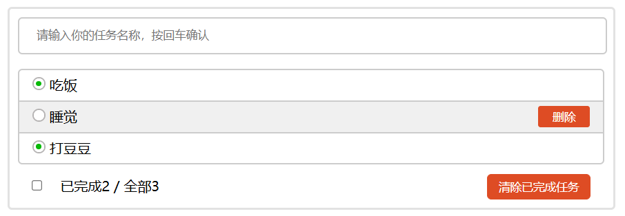

# TodoList v1.0

1. 实现功能：

   - 在输入框输入计划并按下回车，即可出现在下方列表。
   - 鼠标经过列表项即可显示删除按钮，点击后可删除计划项。
   - 下方可实时统计 “已完成/总任务” ，并可一键删除已完成计划项。

2. 技术栈：

   - HTML + CSS + JavaScript
   - Vue + Vue Cli

3. 效果展示

   

4. 下一步计划：增加数据持久化，优化UI

**作者：@Flycan https://github.com/Flycan-Fanc**

